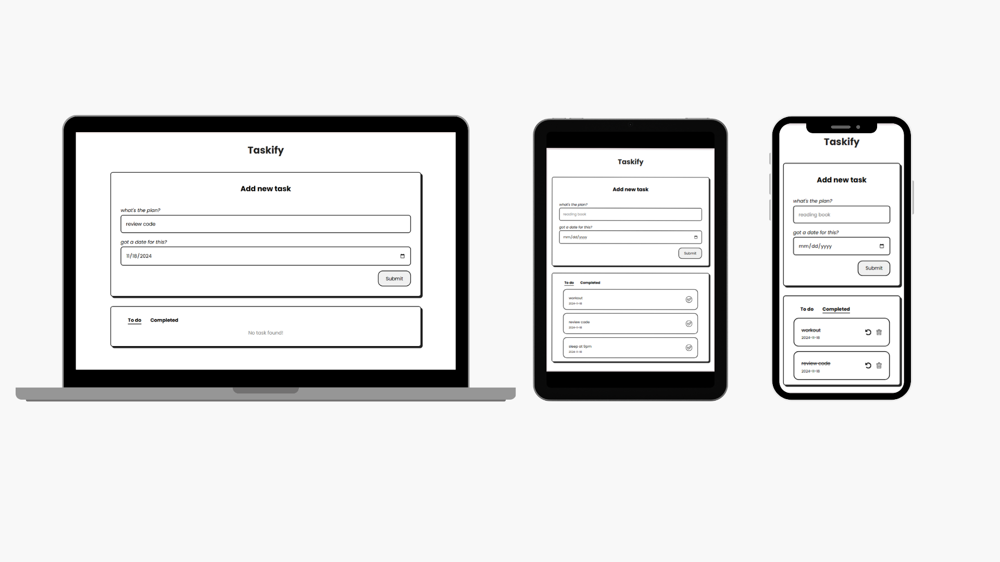

# Taskify - Todo List App

Taskify is a minimal task management app that lets you easily add, update, delete, and track your tasks. It's built using vanilla JavaScript with no dependencies or complex frameworks.

## 💡Features

- **Create Tasks:** Add tasks with just a few clicks.
- **Delete Tasks:** Remove tasks that are no longer needed.
- **Mark Tasks Completed:** Keep track of tasks you've finished.

## 👀Preview

## 🛠️Tech Stack

1. **HTML**
2. **CSS**
3. **JavaScript**

## 🚀Getting Started

- git clone https://github.com/taripuspitasari/taskify.git
- cd taskify
- npm install
- npm run dev

<h3>Thank you for checking out Taskify!</h3>
